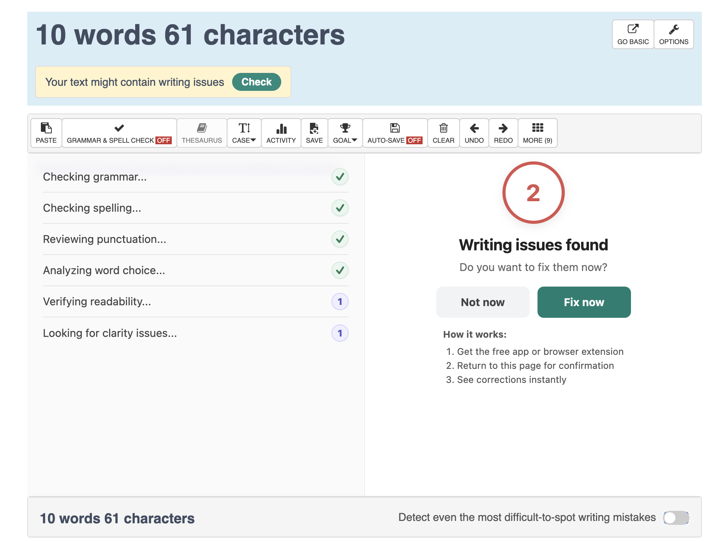
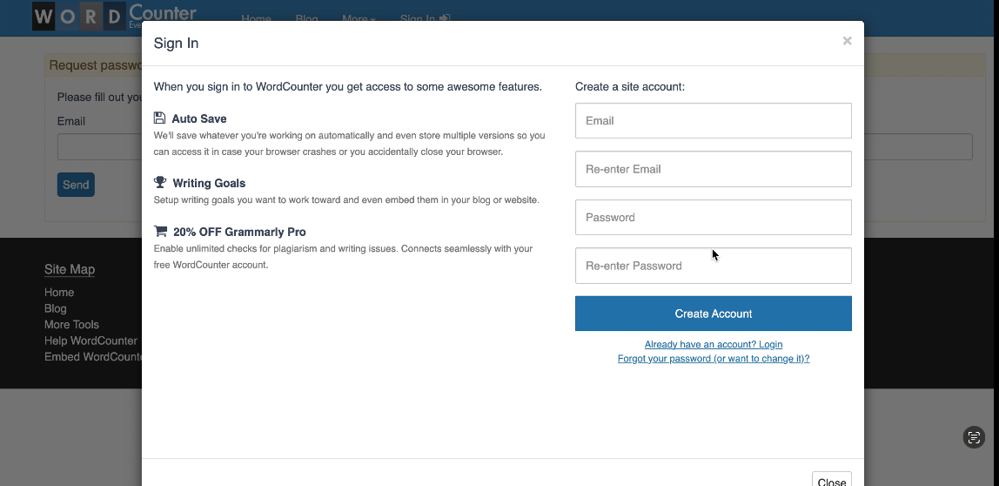

# Defect Analysis Report (BUG Report)

## Severe Performance Degradation (Memory Leak / UI Lag) with Massive Text Volumes (Major)
**Description**: Since text processing analysis (counting words, characters, sentences, reading level, and density) runs in real-time on the browser's main thread via JavaScript, the UI experiences critical input lag when handling extensive data volumes.

**Severity**: High / Major. Issue causes severe UI freezing, extreme CPU consumption, and potential application crashes (Out of Memory).

**Priority**: Medium. The issue is confined to an edge case scenario (massive data volume) that does not affect the majority of daily active users.

**Steps to Reproduce**:
1. Go to https://wordcounter.net/.
2. Paste or type a text exceeding 100.000 words.
2. Attempt to type or delete text in real-time within the editor.

**Expected Result**: Application should work fluently even if the text overcome millions of words.

**Current Result**: The browser tab experiences CPU, keyboard responsiveness drops significantly, it can trigger a forced tab crash due to out-of-memory errors.

**Comments**: The application should utilize Web Workers to process counting threads in the background, keeping the typing experience smooth.

## Switch "Detect even the most difficult-to-spot writing mistakes" is not being activated when it is clicked
**Description**: Once the switch "Detect even the most difficult-to-spot writing mistakes" is clicked, an analysis is executed and opnened on the text form, but the swicht remains disable.

**Severity**: Low. The issue causes confusion to the customer but it is not affecting the functionality of the application.

**Priority**: Low. The issue is not affecting the flow or application use.

**Steps to Reproduce**:
1. Go to https://wordcounter.net/.
2. Paste or type a text with 10 or more words.
3. In the bottom part of the text form the switch "Detect even the most difficult-to-spot writing mistakes" is shown.
4. Click on the switch.

**Expected Result**: Switch should be enable.

**Current Result**: Switch is disable.

**Evidence**: 

## Clicking "Forgot your password?", first change password form is shown
**Description**: When users need to recover their password, and click on "Forgot your password?" link on sign in form, first the change password form is shown, popup is closed and then the request password reset form is shown.

**Severity**: Low. The issue causes confusion to the customer but it is not affecting the functionality of the application.

**Priority**: Low. The issue is not affecting the flow or application use.

**Steps to Reproduce**:
1. Go to https://wordcounter.net/.
2. Click on the "Sign In" menu option
3. In the Sign in form, click on "Forgot your password?" link option

**Expected Result**: Sign in popup is closed and then the request password reset form is shown.

**Current Result**: Change password form is shown on the popup, popup is closed and then the request password reset form is shown

**Evidence**: 

