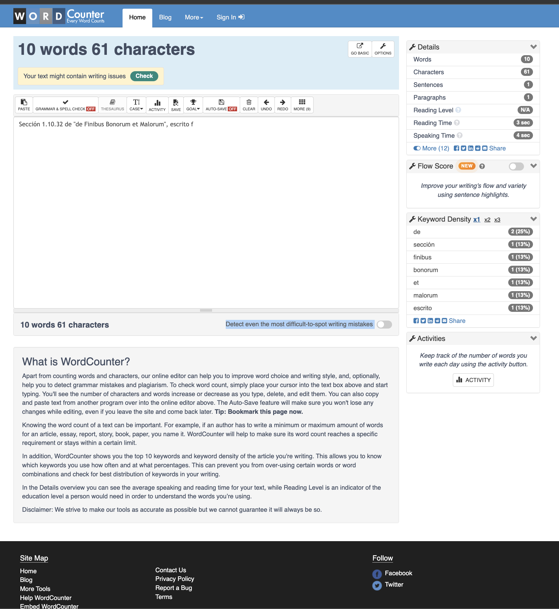
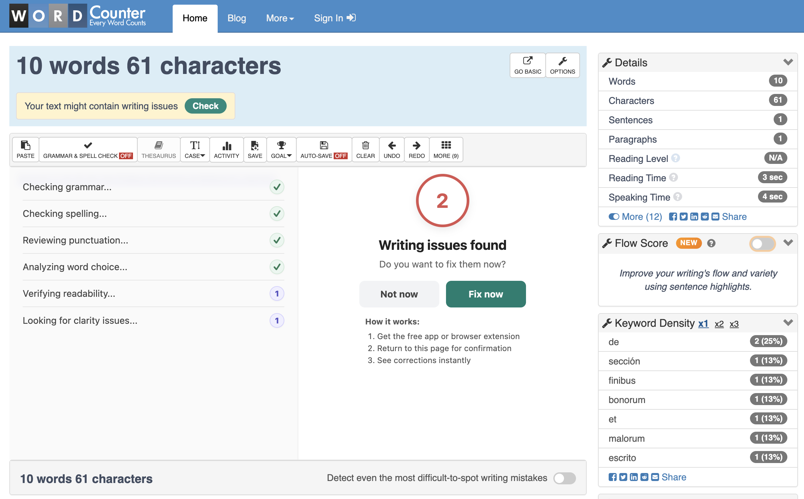

# UX Improvement Report

## Overload & Interface Clutter
**Description**: The main page suffers from severe Information Overload (Cognitive Overload). Apps mixes its core utility tool (the text editor and real-time counter) with an excessive amount of historical, instructional, and informational text about the app itself on the very same page.

By placing massive paragraphs of text—such as "What is Word Counter?", "How to use it?", and detailed SEO explanations—directly below and around the text editor, the interface becomes highly cluttered. This hurts the user experience in two major ways:
- Visual Noise: It distracts the user from their primary goal, which is to write or paste text and analyze it.
- Bad Hierarchy: Important real-time metrics and layout elements compete for visual space with static informational text that regular users only need to read once.

**Severity**: Medium.

**Priority**: Medium.

**Steps to Reproduce**:
1. Go to https://wordcounter.net/.
2. Scroll down below the main text input area.
3. Observe the massive blocks of standard prose text explaining the tool's features, definitions, and guides.
4. Resize the browser window to a lower resolution (e.g., a 13-inch laptop screen or a tablet layout).

**Observed Result**: The critical tool gets buried under promotional banners and dense text blocks, forcing the user to scroll aggressively just to find supplementary metrics or simple instructions. And user lost the main information.

**Recommendations**: Move the data related to the application to another section in the menu, and organize the data in order to show or highlight the main data regarding the analyze executed.

**Evidence**: 

## Feature Transparency
**Description**: The WordCounter.net interface offers a wide array of tools and options (such as advanced tracking, saving drafts, grammar checks, and customizable options). However, the interface fails to clearly distinguish between:

1. Anonymous Features: Tools that can be used freely without an account.
2. Authenticated Features: Tools that require a free account login (e.g., permanent Auto-Save).
3. Premium Features: Tools that might require a subscription or external tool integration.

Currently, a user has to interact with a button or a setting first to find out if they need to log in or pay. This creates unexpected roadblocks, causing user friction and annoyance, as users feel tricked into an authentication wall after they have already initiated an action.

**Severity**: Medium.

**Priority**: Medium.

**Steps to Reproduce**:
1. Open an incognito browser window and go to https://wordcounter.net/ (as a completely new, unauthenticated user).
2. Look at the options menu or the advanced metric configurations.

**Observed Result**: There are no visual markers (like icons, badges, or color-coding) indicating which tools are 100% unrestricted and which ones will trigger a "Please Log In" or external redirect pop-up upon clicking. The system expects the user to guess.

**Recommendations**: Incorporate Visual Badges / Icons: 
- Use a small Lock Icon (🔒) or a "Free" badge next to options that require a standard account login.
- Use a Star/Crown Icon (⭐) or a "Premium" badge next to tools that require payment or external subscriptions.
- Disabled / Visual Gray-out: For functions that are completely inaccessible without logging in, display them in a slightly grayed-out state (disabled opacity) with a clear tooltip on hover that says: "Log in to unlock this feature".
- Transparent Pricing/Features Matrix: Create a quick-access comparison modal or tooltip so users instantly understand what value they unlock by registering versus staying anonymous.

## Redundancy Elimination and Result Overlay Fix
**Description**: The current interface suffers from a redundancy and overlay information, which creates visual clutter and disrupts the user workflow:

1. Redundancy & Duplicated Features: 
- Menu vs. Site Map: links and informational pages in the top navigation menu are exactly duplicated.
- Buttons: The top-level "Grammar & Spell Check" button triggers the exact same third-party functionality as the toggle switch labeled "Detect even the most difficult-to-spot writing mistakes". Having two buttons for the exact same action confuses the user.
2.  Obtrusive Analysis Overlay (Blocking the Workspace): When a user clicks on "Grammar & Spell Check", the results window or pop-up directly overlays and covers the written text. This completely prevents users from reviewing their original writing or comparing it side-by-side with the suggested corrections.

**Severity**: Medium.

**Priority**: Medium.

**Steps to Reproduce**:
1. Go to https://wordcounter.net/.
2. Compare the top navigation links in the Menu with the footer Site Map to observe the duplicated links.
3. Look at the workspace and identify both the top "Grammar & Spell Check" button and the "Detect even the most difficult-to-spot writing mistakes" toggle switch below it.  Click both to confirm they launch the same tool.
4. Paste a paragraph of text, click on "Grammar & Spell Check"
5. Observe how the resulting window blocks your view of the text form.

**Recommendations**: Layout cleanup based on modern workspace design principles:

- Consolidate Redundant Controls: Remove the duplicate toggle switch from the sidebar/editor area. Keep a single, highly visible "Grammar Check" option within the primary toolbar. Streamline the footer sitemap to avoid mirroring the exact same header links.
- Implement a Split-Screen or Side-Panel Layout: Instead of showing grammar results in a floating overlay that covers the text, the analysis should open in a right-side panel or a split-screen view. This layout allows the main text form to automatically resize so the user can see their errors highlighted on the left while reviewing the detailed feedback on the right. Also here app could hide the other metrics in order to focus in the analysis executed.

**Evidence**: 
